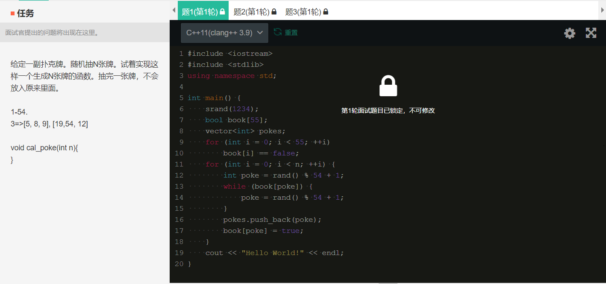
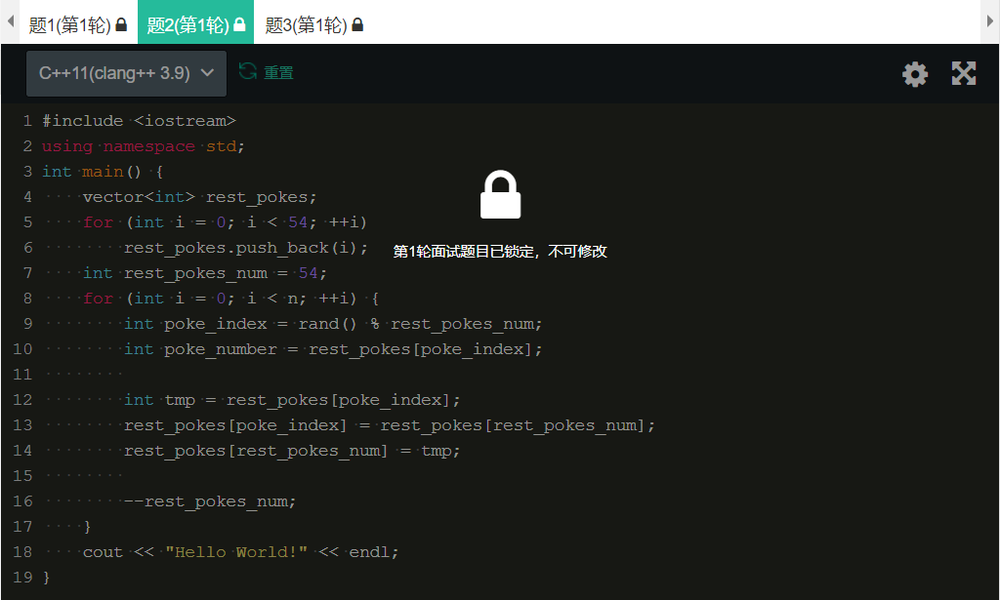
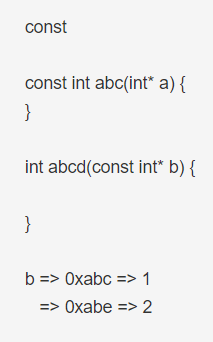
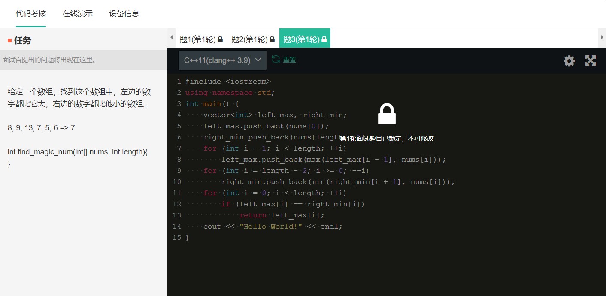

# 字节跳动 - 一面面经

1. 拉家常，询问我软件工程专业学习的内容，对软件工程的看法，是喜欢代码才选的还是因为其他原因（暗指钱多）。回答当然是表决心，I love coding!

2. 来做一道题目，扑克牌随机（不放回）抽牌算法的实现
   - 我先给出了一个naive的版本，即反复循环直到抽到足够数目的牌：

   - 面试官：能不能优化呢？这样子可能会循环很久。
   - 我：可以在一个容器里面不断抽，抽到一个就把它删掉，之后就在剩下的牌里面抽取，因此就只需要循环n次。但是，接到最后我忘了c++的vector stl的删除操作忘了！老实承认后面试官提示我可以用交换代替删除，遂恍然大悟。

3. 面试官：讲讲C++中值传递和引用传递的区别，以及使用的场景
   
4. 面试官：看看这俩const用法的含义和区别。第一个是常量函数，第二个是常量指针（还有一个需要辨析的是指针常量，但是面试官没有提）

5. 面试官：讲一下内存管理机制
   - 我：有LRU、LFU等，然后解释了这两种算法的含义
   - 面试官：如何实现LRU
   - 我：工业上用时钟算法近似LRU即可，若要完整实现LRU则需要用链表和哈希

6. 面试官：好der，那我们再来做一道题，给一个数组，找出一个数，左边的数都比他大，右边的数都比他小
   - 我：首先考虑naive的算法，直接遍历，时间复杂度为O(n^2)
   - 面试官：那如果限制时间复杂度为O(n)呢
   - 我：（思考半天）可以考虑维护两个数组，left_max[i]为0到i中的最大值，right_min[i]为i到length-1的最小值，则left_max与right_min相同的就是那个数，实现如下

   - 面试官：不是每个数组都存在这样的数字的，你考虑的不全面，比如一个数组全是8怎么办？
   - 我：（又思考良久）可以在比较left_max[i]和right_min[i]的同时比较这个target和left_max[i-1]与right_min[i+1]是否不同（一样的话就不符合要求了），必须同时符合这三个条件才是正确的。
   - 面试官：好的，不用实现了

7. 面试官：我的问题结束了，你有什么要问我的嘛
      - 我：整个面试下来，我感觉你其实已经很久没写C++了（因为很多C++的问题感觉他也是凭记忆的2333），我面试的这个大数据研发部门主用的语言是什么？
     - 面试官：我们主写Python和Go，C++是我大学时候写的
     - 我：我没问题了
     - 面试官：好，二面马上来