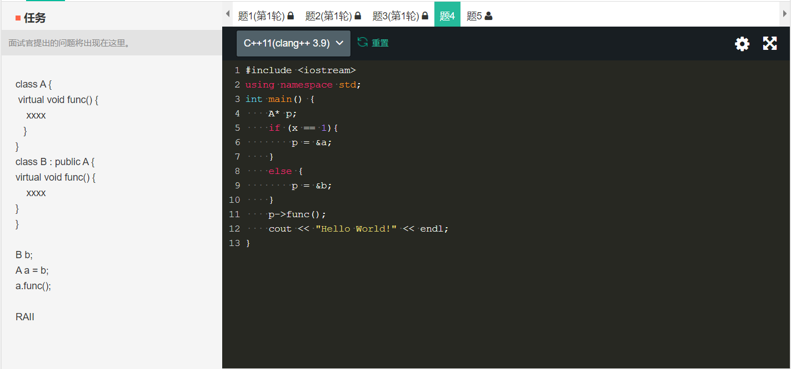
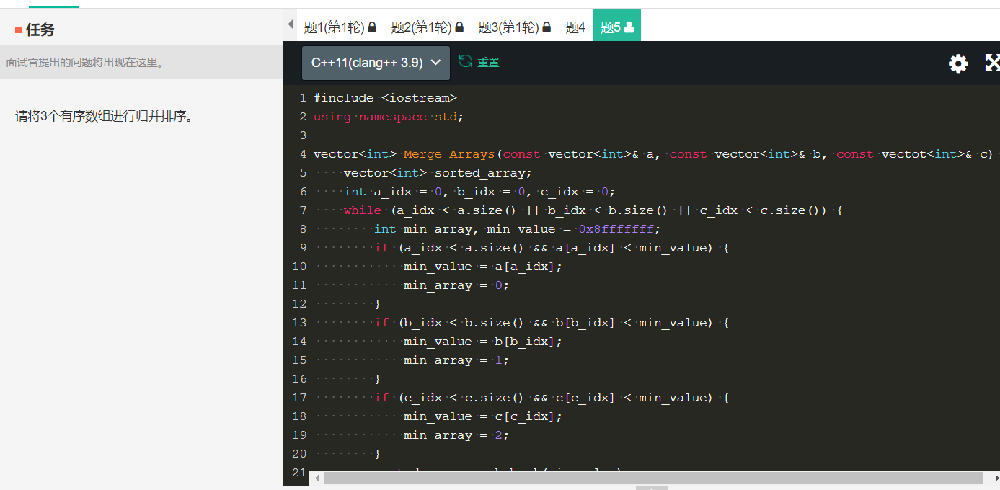

# 字节跳动 - 二面面经

1. 自我介绍，拉家常活动，和一面类似

2. 面试官：你了解排序算法吗？说几个，说说他们的时间复杂度

3. 面试官：对于快速排序，它在什么情况下会退化为O(n^2)？
      - 我：全部正序或者全部倒序
      - 面试官：你确定？
      - 我：难道我记错了？（开始怀疑自己的记忆），然后一通分析。最后在面试官的提示下说出了他想要的标准答案：快排在split阶段选取的中间数都恰好是当时的最大值或者最小值，全部正序和全部倒序只是特例，而且是有条件的（选取中间数的方法是直接取最左边开头或最右边结尾的数，这样才会退化）
   
4. 面试官：C++如何实现多态？
      - 我：利用虚函数，然后开始讲虚函数的知识点，比如动态联编、运行时确定、虚表等等
      - 面试官：那么如何实现动态联编？
      - 我：我可以敲代码演示一下我认为的用法

5. 接下来应该还问了不少C++的问题（因为我说了自己主写C++和Python），但是有些忘了，一个是问RAII，但是我忘了，只能老实承认

6. 面试官：好我们来写一道题吧，实现一下三个数组的归并
      - 我：好。我先按照二路归并的方法写，写到一半发现不行，因为在跳出第一个while循环后，我不好判断究竟是那一个数组被耗尽，就不好在继续比较剩下的两个数组。于是在卡壳良久后，终于写出了解法，就是一个while循环，知道这三个数组全部被取光就可以了

7. 面试官：好的，你有什么问题问我？
      - 我：一面面试官不擅长C++，因为部门主写python和go，你却很了解，是不一样的部门吗？
      - 面试官：balablaaba（网络原因没有听清楚）
      - 我：（假装听懂，点头附和）好的，我没有问题了