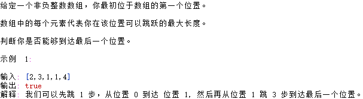
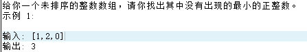

# 腾讯 - 一面面经

1. 自我介绍

2. 做一道题（leetcode原题），我给了自己的解法O(n^2)，然后在引导下优化成了O(n)

3. 再来一道题。应该还是原题，我给了三种解法，直接遍历、归并排序+遍历、桶排序+遍历，最后一个是O(n)的，然后被要求空间复杂度要O(1)，这个没想出来orz

4. 中间穿插问了一句：会不会归并排序的非递归形式？
   - 答曰：不会

5. 智力题：给8个球，有一个比较重，最少称几次可以找出来
   1. 答：两次，分成3、3、2，先称3-3，然后分类讨论

6. 问项目，介绍了数学建模（排队论）和Click Model，这里面试官的领域和我的有很大的差异性，所以基本就是我向他介绍这个领域的所有基础概念，但是综述都有八十多页呢，我tm怎么二十分钟讲明白。所以到最后，面试官还是有困惑，但还是跳过了项目环节。

7. 机器学习基础知识，先后问了支持向量机、支持向量回归、LSTM的结构。