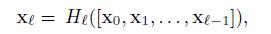

1. 如何防止**过拟合**？ - 增加训练样本、增加属性、降低模型复杂度、dropout、正则化、early stop、BN、集成模型

2. **正则化**：可以限制模型的复杂度，从而尽量避免过拟合的发生；模型之所以出现过拟合的主要原因是学习到了过多噪声，即模型过于复杂（也可以通过简化模型或增加数据集等方法尽量避免过拟合的发生）
   1. L0正则化：模型参数中非零参数的个数，不可导，用L1近似
   2. L1正则化（ridge，岭回归）：绝对值之和，可以通过稀疏化（减少参数“数量”）来降低模型复杂度的，即可以将参数值减小到0。（间接选择特征）
   3. L2正则化（lasso）：平方和，可以通过减少参数值“大小”来降低模型的复杂度，即只能将参数值不断减小，但永远不会减小为0，只能尽量接近于0。
   4. L1是和特征关联的情况，L2适合特征不关联的情况
   5. L1惩罚项降维的原理在于保留多个对目标值具有同等相关性的特征中的一个，所以没选到的特征不代表不重要。故，可结合L2惩罚项来优化。
   6. L1不可导，用坐标轴下降法

3. **特征选择**
    1. Filter：过滤法，按照发散性或者相关性对各个特征进行评分，设定阈值或者待选择阈值的个数，选择特征。
       1. 方差选择法：先计算各个特征的方差，然后根据阈值，选择方差大于阈值的特征。
       2. 相关系数法：先要计算各个特征对目标值的相关系数以及相关系数的P值。皮尔森系数
       3. 互信息法：经典的互信息也是评价定性自变量对定性因变量的相关性的
       4. 卡方检验：检验定性自变量对定性因变量的相关性，观察值与理论值之问的偏离程度
    2. Wrapper：包裹法，根据目标函数（通常是预测效果评分），每次选择若干特征，或者排除若干特征
       1. 结果上，包裹法能好，但多次训练开销大
       2. LVM（拉斯维加斯方法）递归特征消除 (Recursive Feature Elimination)：每次取当前属性集的子集，交叉验证，维护最小误差，如果误差减小或者误差相同但是属性集变小，就替换属性集，若T次迭代仍无改进，则算法结束
    3. Embedded：嵌入法，先使用某些机器学习的算法和模型进行训练，得到各个特征的权值系数，根据系数从大到小选择特征。类似于Filter方法，但是是通过训练来确定特征的优劣。
       1. L1正则化
       2. 随机森林：如果加入随机噪声后，袋外数据准确率大幅下降，说明这个特征对预测结果有很大的影响，进而说明它的重要程度比较高
          1. 对于每一棵决策树，用OOB 计算袋外数据误差，记为 errOOB1；
          2. 然后随机对OOB所有样本的特征i加入噪声干扰，再次计算袋外数据误差，记为errOOB2；
          3. 假设有N棵树，特征i的重要性为sum(errOOB2-errOOB1)/N;
       3. GDBT：特征i在单棵树的重要度主要是通过计算按这个特征i分裂之后损失的减少值，然后对树求平均
       4. xgboost：通过该特征每棵树中分裂次数的和去计算的，比如这个特征在第一棵树分裂1次，第二棵树2次……，那么这个特征的得分就是(1+2+...)。
    4. 稀疏性：有很多零元素
       1. 线性支持向量机之所以能在文本数据上有很好的性能，恰是由于文本数据在使用上述的字频表示后具有高度的稀疏性，使大多数问题变得线性可分.
       2. 稀疏学习，把稠密向量边稀疏
    5. PCA是为了让映射后的样本具有最大的发散性；而LDA是为了让映射后的样本有最好的分类性能。所以说PCA是一种无监督的降维方法，而LDA是一种有监督的降维方法。

4. **Dropout**
   1. 从两个角度理解dropout
      1. 通过参数共享提供了一种廉价的Bagging集成近似，每次训练都是有些不一样的模型（bagging是生成k个不同的数据集，训练k次）
      2. 失活，可以理解为特征选择（L1正则化）
   2. 训练时用，测试不用。从期望的角度，说明了训练时要除以概率p，或者测试时乘概率p。

5. **BatchNorm**
   1. 背景：
      1. Internal Convariate shift：每一次参数迭代更新后，上一层网络的输出数据经过这一层网络计算后，数据的分布会发生变化，为下一层网络的学习带来困难（神经网络本来就是要学习数据的分布，要是分布一直在变，学习就很难了）
      2. Covariate Shift和Internal Covariate Shift具有相似性，但并不是一个东西，Internal发生在神经网络的内部，前者发生在输入数据上。Covariate Shift主要描述的是由于训练数据和测试数据存在分布的差异性，给网络的泛化性和训练速度带来了影响，我们经常使用的方法是做归一化
   2. 好处：
      1. 加速：因为神经网络本质上是学习数据的分布情况，而mini-batch每次都会有不同的分布，也就是说，每次训练的数据都有不同的分布，数据抖动很大，所以权重变化也会很大。而batch norm会将数据归一化，减少不同batch间数据的抖动情况，从而提高训练速度
      2. 防止过拟合（非主要）：BN每次的mini-batch的数据都不一样，但是每次的mini-batch的数据都会对moving mean和moving variance产生作用，可以认为是引入了噪声，这就可以认为是进行了data augmentation，而data augmentation被认为是防止过拟合的一种方法。因此，可以认为用BN可以防止过拟合。
   3. 方法：一般是conv+BN+relu，
   
   5. 为什么不只做归一化，而是引入两个参数？
      1. 如果每一层的数据分布都是标准正太分布，导致其完全学习不到输入数据的特征，因为，费劲心思学习到的特征分布被归一化了，因此，直接对每一层做归一化显然是不合理的。
      2. 不重构的话，只进行归一化会降低表征能力
      3. β和γ分别称之为平移参数和缩放参数。这样就保证了每一次数据经过归一化后还保留的有学习来的特征，同时又能完成归一化这个操作，加速训练。
   6. 如何更新两个参数？momentum=0.1
      1. running_mean = momentum * running_mean + (1 - momentum) * x_mea
      2. running_var = momentum * running_var + (1 - momentum) * x_var
   7. 训练和测试的区别？
      1. 训练阶段：首先计算均值和方差（每次训练给一个批量，计算批量的均值方差），然后归一化，然后缩放和平移，完事！
      2. 测试阶段：每次只输入一张图片，在训练的时候实现计算好mean、 var，测试的时候直接拿来用就可以了，不用计算均值和方差。
   8. BN并不是适用于所有任务的，在image-to-image这样的任务中，尤其是超分辨率上，图像的绝对差异显得尤为重要，所以batchnorm的scale并不适合。

6. **特征放缩**（决策树和随机森林不用）
   1. 归一化：减去最小值，除以范围，变到[0,1]
   2. 标准化：减去均值，除以标准差，更好，保留了异常值所蕴含的有用信息

7. **回归与分类**的本质区别：
   1. 两者的的预测目标变量类型不同，回归问题是连续变量，分类问题离散变量。
   2. 回归问题是定量问题，分类问题是定性问题。
   3. 回归与分类的根本区别在于输出空间是否为一个度量空间。对于回归问题，其输出空间B是一个度量空间，即所谓“定量”。也就是说，回归问题的输出空间定义了一个度量去衡量输出值与真实值之间的“误差大小”。例如：预测一瓶700毫升的可乐的价格（真实价格为5元）为6元时，误差为1；预测其为7元时，误差为2。这两个预测结果是不一样的，是有度量定义来衡量这种“不一样”的。（于是有了均方误差这类误差函数）。对于分类问题，其输出空间B不是度量空间，即所谓“定性”。也就是说，在分类问题中，只有分类“正确”与“错误”之分，至于错误时是将Class 5分到Class 6,还是Class 7，并没有区别，都是在error counter上+1

8. **卷积**
   1. **局部连接**：首先在图像上得到应用，图像局部像素联系紧密，距离较远的像素相关性较弱，CNN只需要对局部进行感知，然后接下来的隐含层中再对局部的信息综合起来，这样就提取成了一个新的保留了原来主要特征的图像。上面的局部信息对其他领域也适用，只要数据样本具备“局部联系紧密”的特点，比如文本翻译
   2. **权值共享**：核的每个元素都作用在每一个位置上，也就是一个核会和整个图片的所有区域局部交互
   3. 上述方法减少了参数量，m个输入和n个输出，矩阵乘法需要 m*n个参数，时间复杂度O(m*n)。局部连接只需要k*n个参数，运行时间为 O(k*n)。参数共享只用k个参数，运行时间仍为 O(k*n)
   4. 尺寸计算：output = (input - kernel_size + 2 * pad) / stride + 1

9. **池化**pooling
   1. 降维减少参数量、减少卷积后的冗余、增大深层卷积的感受野
   2. max pooling（文本分类，只保留强特征）、average pooling（句子主题模型，尽可能多的上下文信息）、k-max pooling

10. **感受野**：定义了feature map上的一个点来自于原图的范围。
    1.  神经元感受野的值越大表示其能接触到的原始图像范围就越大，也意味着它可能蕴含更为全局，语义层次更高的特征；相反，值越小则表示其所包含的特征越趋向局部和细节。因此感受野的值可以用来大致判断每一层的抽象层次。
    2.  如何增大感受野：加深网络、使用膨胀卷积（隔一个做乘积）
    3.  从深处开始算，j层在j-1层的感受野，RF(j-1) = kernel(j) + (RF(j) - 1) * stride(j)

11. **激活函数**
    1.  多层神经网络中，上层节点的输出和下层节点的输入之间具有一个函数关系，称为激活函数。如果没有激励函数，你每一层节点的输入都是上层输出的线性函数，无论你神经网络有多少层，输出都是输入的线性组合，相当于没有隐藏层，网络的学习能力有限。
    2.  sigmoid，[0,1]
        1.  梯度消失：如果我们初始化神经网络的权值为 [0,1]之间的随机值，sigmoid梯度不超过0.25，多层后将变得非常小接近于0，即出现梯度消失
        2.  输出不是zero-centered
        3.  幂运算，开销大
        4.  饱和区间
    3.  tanh，[-1,1],解决了sigmoid不是zero-centered输出问题，梯度消失和幂运算的问题仍然存在。
    4.  relu，解决梯度消失问题，计算快i，收敛速度快（因为梯度大，relu为1，tanh和sigmoid小于1），但有以下缺点
        1.  输出不是zero-centered
        2.  Dead ReLU Problem，指的是某些神经元可能永远不会被激活，导致相应的参数永远不能被更新。有两个主要原因可能导致这种情况产生
            1.  非常不幸的参数初始化，少见，例如w初始化全部为一些负数。
            2.  learning rate太高导致在训练过程中参数更新太大，不幸使网络进入这种状态。解决方法是可以采用Xavier初始化方法，使用adagrad等自动调节learning rate的算法。
        3.  原点不可导
    5. leaky relu，改善dead relu
    6. elu，不会有dead relu，接近zero-centered。但计算量大，原点不可导

12. **梯度下降算法**
    1. Batch gradient descent (BGD)：也称为Vanilla gradient descent，需要计算整个训练集的梯度。
       1. 优点：对于凸目标函数，可以保证全局最优； 对于非凸目标函数，可以保证一个局部最优。
       2. 缺点：速度慢; 数据量大时不可行; 无法在线优化(即无法处理动态产生的新样本)。
    2. Stochastic gradient descent (SGD)：每次更新只用一个样本（随机采样）的梯度
       1. 优点：更新频次快，优化速度更快; 可以在线优化(可以无法处理动态产生的新样本)；一定的随机性导致有几率跳出局部最优(随机性来自于用一个样本的梯度去代替整体样本的梯度)
       2. 缺点：随机性可能导致收敛复杂化，即使到达最优点仍然会进行过度优化，因此SGD得优化过程相比BGD充满动荡
    3. Mini-batch gradient descent (MBGD)：计算mini-batch的梯度：
       1. 优点：参数更新时的动荡变小，收敛过程更稳定，降低收敛难度；可以利用现有的线性代数库高效的计算多个样本的梯度。
    4. 算法优化面临如下挑战：
       1. 如何选择合适的学习率？ - 学习率过小导致收敛太慢，过大又导致收敛动荡甚至偏离最优点。
       2. 如何确定学习率的调整策略？ - 目前调整学习率基本都按照一种 “退火”的思想，要么按照预定模式调整，要么根据目标函数值的变化是否满足阈值动态改变学习率。 但是，“模式”和“阈值”都需要事先指定，无法自适应不同数据集。
       3. 对所有参数的更新采用相同的学习率是否恰当？ - 如果数据是稀疏的且特征分布不均，似乎我们更应该给予较少出现的特征一个大的更新。
       4. 如何跳出局部最优？- 理论上只有严格的凸函数才可以通过梯度下降获得全局最优解。 但是，神经网络所面临的基本上都是严重非凸的目标函数，这也意味着优化容易陷入局部最优。 事实上，我们的困难往往来自 “鞍点” 而非局部极小点。 鞍点周围通常拥有相同的损失函数值，这导致SGD很难发挥作用，因为每个方向的梯度都接近于0.

13. ResNet
    1. 残差网络主要解决了网络退化的问题（随着网络的深度增加，准确度反而下降了）
    
    2. ResNet提出了两种mapping：
       1. identity mapping，顾名思义，就是指本身.指的就是图1中”弯弯的曲线”
       2. residual mapping，指的就是除了”弯弯的曲线“那部分，指的是“差”,所以最后的输出是 y=F(x)+x
       3. 残差指的就是F(x)部分。
    3. 理论上，对于“随着网络加深，准确率下降”的问题，Resnet提供了两种选择方式，也就是identity mapping和residual mapping，如果网络已经到达最优，继续加深网络，residual mapping将被push为0，只剩下identity mapping，这样理论上网络一直处于最优状态了，网络的性能也就不会随着深度增加而降低了。

14. DenseNet
    
    1. [x0,x1,…,xl-1]表示将0到l-1层的输出feature map做concatenation。concatenation是做通道的合并(这里各个层的特征图大小是相同的)，而前面resnet是做值的相加，通道数是不变的。Hl包括BN，ReLU和3*3的卷积。l层的输出是0到l-1层层的输出的concatenation。

15. 梯度消失和梯度爆炸？
    1.  解决梯度爆炸：
        1.  可以通过梯度截断。通过添加正则项。
    2.  解决梯度消失：
        1.  将RNN改掉，使用LSTM等自循环和门控制机制。
        2.  优化激活函数，如将sigmold改为relu
        3.  使用batchnorm
        4.  使用残差结构